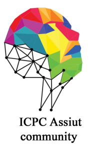

# Assiut-University-Traning-with-OOP-Class---SayemSamir-

## 👋 **[Sheets link](https://codeforces.com/group/MWSDmqGsZm/contests)** 👋

## Description
THIS REPO IS YOUR FIRST STEP IN COMPATITVE PROGRAMING WORLD :
By following this repo you will solve all of necomers training and you will improve your problem solving skills.
I solved all those problems by using c++ programing language .
I sorted the repo folders to help you organize your steps .

## Solutions
I impleneted more than one solution in some problems .
i capsulated using functions like this following example:

* solution number 1 👇
```cpp
void solution1()
{
   string str, temp;
   getline(cin, str);
   char ch;
   for (int i = 0; i < str.size(); i++)
   {
       if (str[i] != ' ')
       {
           temp += str[i];
       }

       if ((str[i] == ' ' || i == str.size() - 1) && temp.size() != 0)
       {

           for (int j = 0; j < temp.size() / 2; j++)
           {
               ch = temp[j];
               temp[j] = temp[temp.size() - 1 - j];
               temp[temp.size() - 1 - j] = ch;
           }

           if (i == str.size() - 1)
           {
               cout << temp;
           }
           else
           {
               cout << temp << " ";
           }
           temp.clear();
       }
   }
}
```
* solution number 2 👇
```cpp
void solution2()
{
   string str;
   bool space = false;
   while (cin >> str)
   {
       reverse(str.begin(), str.end());
       if (space)
       {
           cout << " ";
       }
       space = true;
       cout << str;
   }
}
```
## my codeforces handle 👇:
[sayem197](https://codeforces.com/profile/sayem197)

### Connect with me:
click the icon to contact 👇 :

[]([YOUR_TWITTER_PROFILE_URL](https://x.com/SamirSayem80470))
[](https://www.facebook.com/mdsayem197)
[](https://www.instagram.com/mdsayem197)


